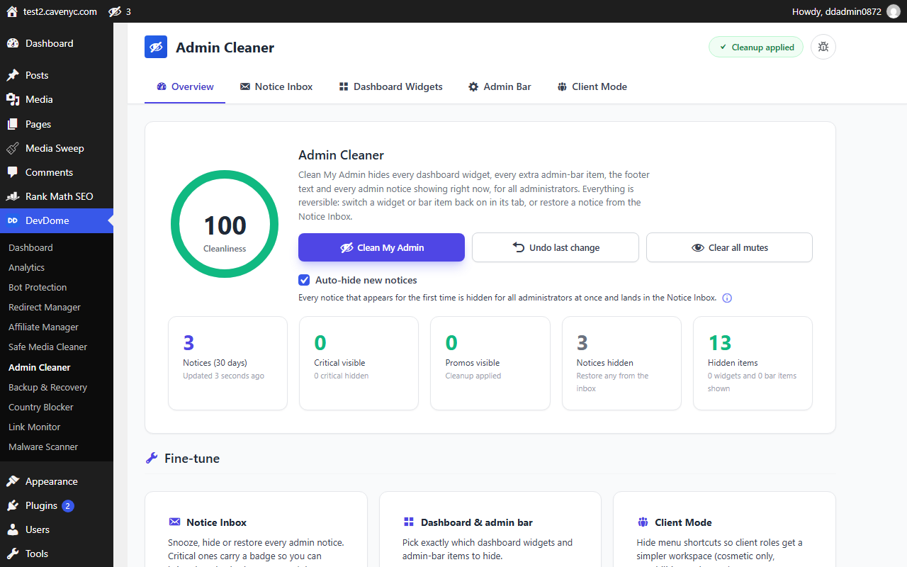
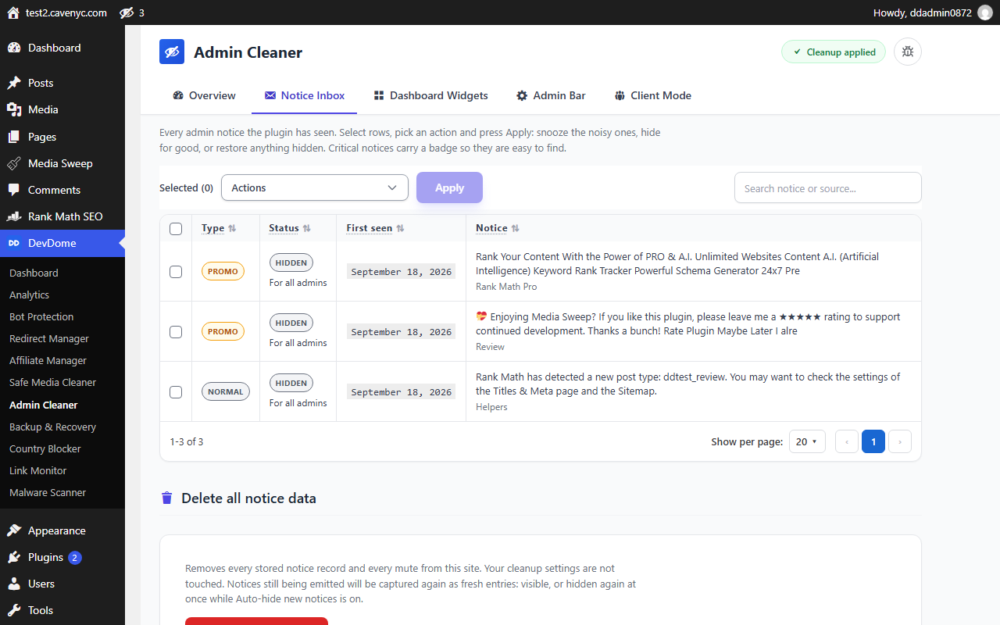
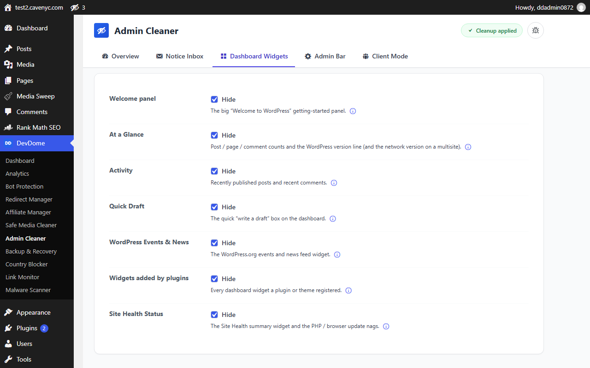
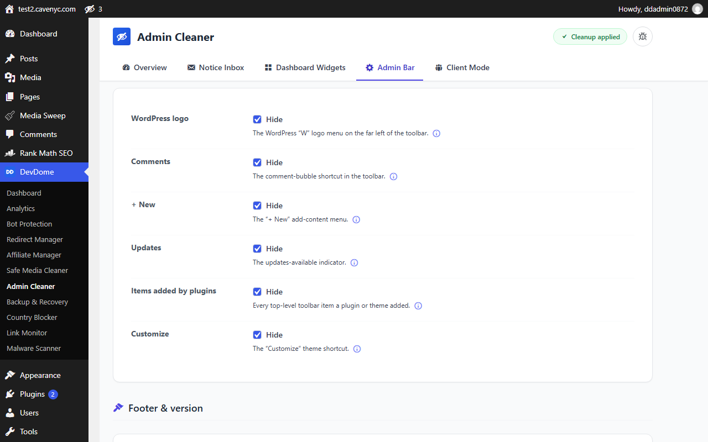
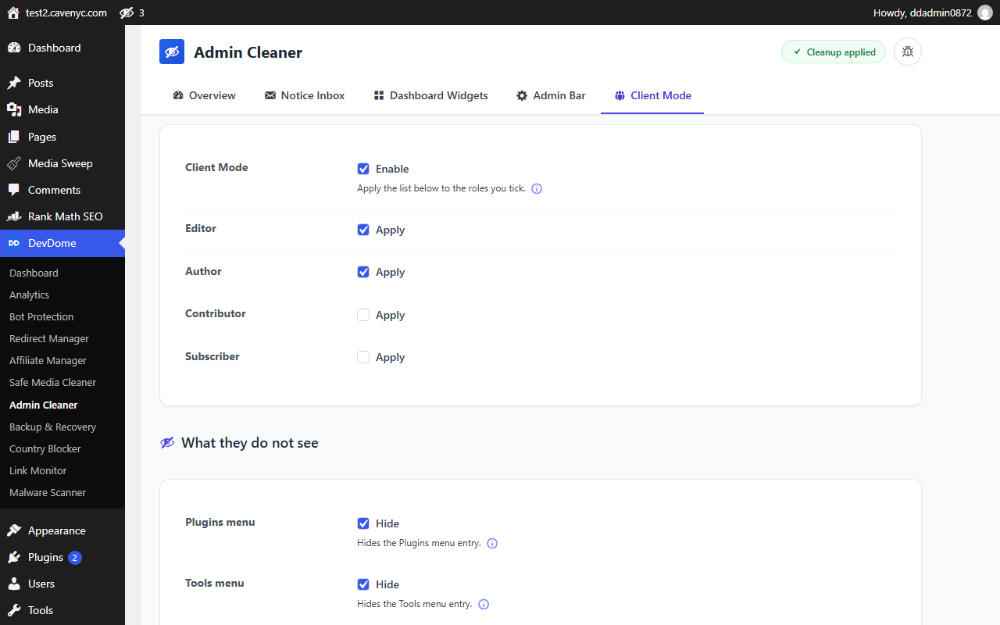

# DevDome Admin Cleaner - hide admin notices, remove dashboard widgets and clean up the WordPress admin

- **Install from WordPress.org:** https://wordpress.org/plugins/devdome-admin-cleaner/
- **Website:** https://devdome.com
- **Support:** https://wordpress.org/support/plugin/devdome-admin-cleaner/

Free, GPL, no paid tier. This repository mirrors the release published on WordPress.org.

DevDome Admin Cleaner helps you hide admin notices, remove dashboard widgets and clean up the admin bar. Keep captured notices in a Notice Inbox and use Client Mode to simplify menus for selected roles.

* Hide plugin notices for yourself or all administrators. Snooze selected notices for 1 or 7 days.
* Remove dashboard widgets from view, including the Welcome panel, Activity, Quick Draft, At a Glance, Events & News and Site Health. Hide widgets added by plugins and themes too.
* Use admin bar cleanup to hide the logo, Comments, New, Updates, Customize and extra top-level items added by plugins or themes.
* Hide admin footer text, the version number and notice rows beneath plugins on the Plugins screen.
* Review notice sources, classifications, first-seen dates and mute status. An optional toolbar bell links to the inbox.
* Check the workspace clutter estimate and its inverse, the Cleanliness indicator. These reflect workspace preferences, not site health or security. Hiding Site Health or Updates does not improve them.

### How it works

Open DevDome Tools > Admin Cleaner. Choose individual settings and press Save Settings, or press Clean My Admin for a broad cleanup.

Clean My Admin hides dashboard widgets, the supported toolbar items, footer text, the version number and plugin list notice rows. It also hides all notices already captured in the inbox for all administrators and enables Auto-hide new notices. Auto-hide includes supported notices added after page load.

This includes update, error and security notices. Recognised operational notices carry a Critical badge in the inbox. Restore a notice to show it again for everyone. Notice hiding applies only to users who can access Admin Cleaner, normally administrators.

Undo last change restores the previous settings once. Notice mutes are separate: use Restore or Clear all mutes to show hidden notices again. Turn off Auto-hide new notices if you want future notices to remain visible.

Admin Cleaner works on its own and also shows its summary in the shared DevDome Tools dashboard.

### Client Mode

Choose from the roles registered on your site, including custom roles. Client Mode can hide Plugins, Tools, Settings, editor and Updates menu entries, plus the footer version number. It supports a simpler client handover and basic white label admin cleanup.

Client Mode never changes roles or capabilities. With the corresponding options enabled, the theme editor, plugin editor and Updates screens redirect to the dashboard. Other direct URLs still follow the user's existing permissions. Users with manage_options, the Admin Cleaner capability or network management privileges are exempt.

### What it never does

Cleanup never deletes posts, pages, media, plugins or themes. It never changes user permissions or replaces access control. Hiding update notices does not disable updates or fix the issues they report.

Removing inbox records, deleting all notice data and retention housekeeping can permanently delete the plugin's stored notice records and mutes. Uninstalling removes its settings and notice data.

### Local data and privacy

Settings, notice records and mutes stay in your site's options table. Notice excerpts are redacted before storage and limited to 160 characters. Redaction removes email addresses, tokens, keys, nonces, URL query strings and filesystem paths. Raw notice HTML is never stored.

Retention targets 200 records. Unresolved protected notices are kept even when this exceeds the limit, with a storage warning. Expired snoozes and orphaned mutes are cleaned automatically. Delete all notice data removes stored notices and mutes without resetting settings.

Admin Cleaner sets no cookies and sends no visitor data off-site. Its cleanup features run locally and need no external service. Shared dashboard requests, optional account connections and user-submitted error reports are described in External services.

### AI agents and abilities

On WordPress 6.9 or newer, 14 abilities let authorised AI agents inspect settings and notices, apply cleanup, undo settings, manage notices and run housekeeping. MCP clients can use them through the WordPress MCP Adapter. Abilities include snoozing for 1 to 90 days. Every ability checks the plugin capability. Actions affecting all administrators or deleting records require explicit confirmation where specified. Agent output excludes email addresses and server paths. Older versions register no abilities.

## Screenshots

*Overview: Clean My Admin, the workspace clutter estimate and what is hidden right now.*

*Notice Inbox: every captured notice with its source, type and status.*

*Dashboard Widgets: choose which dashboard widgets and footer items to hide.*

*Admin Bar: hide the WordPress logo, Comments, New, Updates, Customize and plugin items.*

*Client Mode: pick the roles and the menu entries they no longer see.*

## Install

1. In WordPress go to Plugins, Add New, search for "DevDome Admin Cleaner", then install and activate. Or download the zip from
   [WordPress.org](https://wordpress.org/plugins/devdome-admin-cleaner/).
2. Open DevDome Tools, Admin Cleaner.
3. Press Clean My Admin, or pick individual settings and press Save Settings.

With Composer: `composer require devdome/devdome-admin-cleaner`

## FAQ

### How do I hide admin notices?
Open DevDome Tools > Admin Cleaner > Notice Inbox. Select notices, choose Hide (you), Hide for all admins or a snooze action, then press Apply. To remove admin notices from view in one step, use Clean My Admin. It also enables Auto-hide new notices.

### How do I remove dashboard widgets?
Open the Dashboard Widgets tab. Select the widgets you want to hide and press Save Settings. Built-in widgets have individual options. Widgets added by plugins and themes have a shared option. Clean My Admin turns on all these hiding options.

### Is anything deleted when I clean the dashboard?
Clean My Admin hides interface items and notices. It does not delete your content. Remove and Delete all notice data permanently delete stored inbox records and their mutes. Retention housekeeping can also delete eligible records. A deleted notice can return if its source displays it again. Uninstalling removes the plugin's settings and notice data.

### Does it hide update notices or disable admin notifications?
It can hide on-screen update, error and security notices, including those marked Critical. Clean My Admin also hides the toolbar Updates item and plugin list notice rows. It does not disable updates or notification emails. Restore captured notices from the inbox and turn off Auto-hide if you want new notices to remain visible.

### What does Client Mode do?
Client Mode hides selected menu entries for the roles you choose. It can also redirect the theme editor, plugin editor and Updates screens to the dashboard. Permissions stay unchanged. Users with manage_options, the Admin Cleaner capability or network management privileges are exempt. Notice hiding is separate and applies only to users who can access Admin Cleaner.

### Does it work on multisite?
Settings and notice records are stored separately for each site. Configure Admin Cleaner from each site's dashboard. The code also handles network dashboard widgets and network admin notice hooks. There is no central screen for applying one configuration across every site.

### How do I undo the cleanup?
Undo last change restores the settings from before the most recent settings change. It keeps one recovery point. Restore notices separately in the inbox, or use Clear all mutes. Turn off Auto-hide new notices to stop hiding future notices. You can also show individual widgets and toolbar items again through their settings. Deactivation stops the plugin's cleanup while preserving its saved data.

## External services and privacy

The cleanup features run on your own site and need no external service. What the bundled DevDome library may contact, and only when,
is listed in full in the External services and Privacy sections of [readme.txt](readme.txt).

## License

GPL-2.0-or-later. See [LICENSE](LICENSE).
